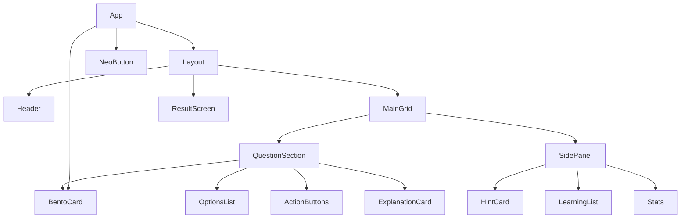

# Design: React Quiz Engine

## Architecture

The application will follow a standard React functional component architecture using `useState` for local state management. Given the limited scope (single user, ephemeral session), global state management libraries (Redux, Zustand) are unnecessary.

### Component Hierarchy



## Data Structure

The quiz data will be stored as a constant array of objects to allow for easy extension or future API integration.

```typescript
interface QuizQuestion {
  id: number;
  category: string;
  question: string;
  options: string[];
  answer: number; // Index of the correct option
  hint: string;
  explanation: string;
}
```

## UI Design System (Neo-Brutalism)

The design relies heavily on Tailwind CSS for utility classes.

- **Colors:** High contrast (Yellow-400, Cyan-400, Pink-400, Green-400) against Black/White.
- **Borders:** `border-3` or `border-4` solid black.
- **Shadows:** Hard shadows (`box-shadow: Xpx Ypx 0px 0px #000`).
- **Typography:** 'Noto Sans TC', Bold/Black weights.

## User Flow

1.  **Start:** User sees the first question immediately.
2.  **Selection:** User clicks an option (local state updates `selected`).
3.  **Confirmation:** User clicks "Confirm".
    - **Correct:** `isRevealed` becomes true, `score` increments, Explanation appears.
    - **Incorrect:** UI shakes/shows error, user must try again (or maybe just shown correct answer depending on strictness - POC implies "Try Again" or just showing wrong state). _Decision: Allow retry or show correct answer immediately? POC suggests `isWrong` state triggers a bounce animation, implying retry until correct or forcing a "reveal" flow. I will stick to the POC's flow: Select -> Confirm -> Result._
4.  **Next:** User clicks "Next Question" to advance `currentIdx`.
5.  **End:** After last question, `showResult` triggers the Result Screen.
